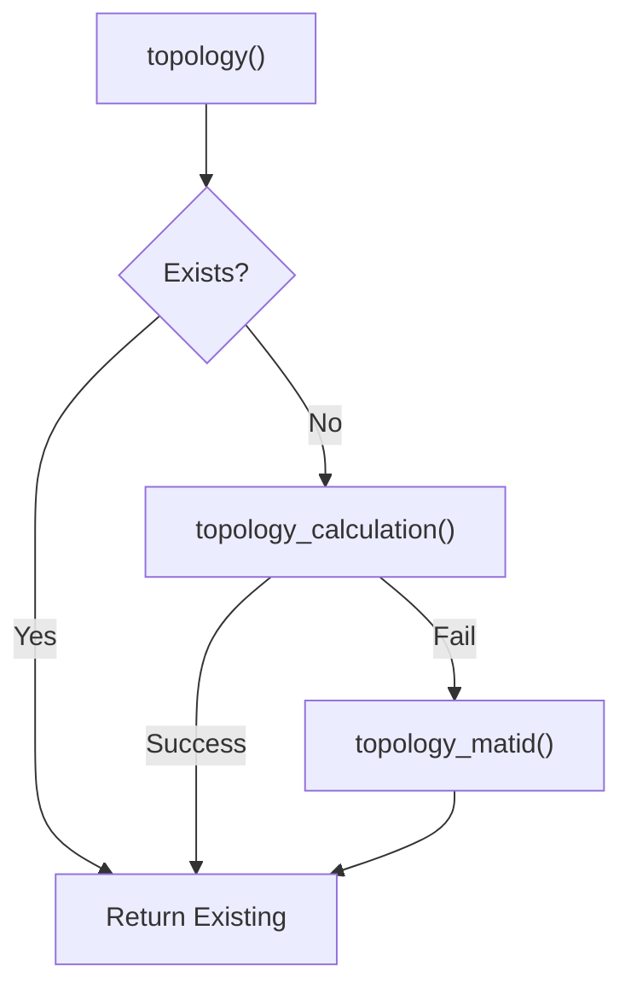
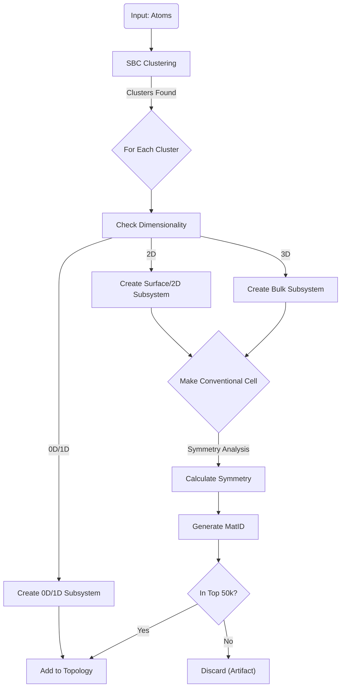


# Material & Topology Normalizer Structure

  

**Context**: This gist focuses on the `MaterialNormalizer` and `TopologyNormalizer` classes. Other components (`ResultsNormalizer`, Property Resolution) are mentioned only for context. There are more stuff to the normalizers but here I gathered the essentials.

  

---

  

## 1. MaterialNormalizer

**File**: `nomad/normalizing/material.py`

**Responsibility**: Creates the `results.material` section, describing the material's chemical identity, symmetry, and classification.

  

### Core Logic: `material()`

The main entry point. It manages the population of the material section.

  

1.  **Chemical Info**:

* Takes `repr_system.chemical_composition_hill` (populated by `SystemNormalizer`).

* Uses `nomad.atomutils.Formula` to derive:

*  `chemical_formula_hill`

*  `chemical_formula_iupac`

*  `chemical_formula_reduced`

*  `chemical_formula_descriptive`

*  **Fragmentation**: If atoms have labels, it computes `chemical_formula_reduced_fragments` to describe parts (e.g., monomers).

  

2.  **Structural Classification**:

* Reads `run.m_cache['classification']` (computed by `SystemNormalizer` using `matid`).

*  **Mapping**:

*  `Class3D` → `3D` (Bulk)

*  `Surface` / `Material2D` → `2D` (Building block: `surface` / `2D material`)

*  `Atom` / `Class0D` → `0D` (Atom)

*  `Class1D` → `1D` (Wire)

  

3.  **Material ID Generation**:

*  **Bulk**: `material_id_bulk(spg_number, wyckoff_sets)` (Fingerprint based on symmetry).

*  **2D**: `material_id_2d(spg_number, wyckoff_sets)` (Fingerprint for sheets).

*  **1D**: `material_id_1d(conv_atoms)` (Fingerprint for wires).

  

4.  **Springer Integration**:

* Function: `material_classification()`

* Logic: Checks `repr_system['springer_material']`. If matches are found, extracts:

*  `material_class_springer` (e.g., "Inorganic")

*  `compound_class_springer` (e.g., "Oxide")

  

5.  **Naming**:

* Function: `material_name()`

* Logic: Assigns human-readable names for systems.

  

6.  **Topology Normalizer**:

* Instantiates `TopologyNormalizer` and calls `topology()`.

  

### Method: `symmetry()`

Populates the `results.material.symmetry` section.

  

*  **Source**: `self.repr_symmetry` (The symmetry section from `run.system`, calculated by `SystemNormalizer`).

*  **Fields Copied**:

*  `hall_number`, `hall_symbol`

*  `bravais_lattice`, `crystal_system`

*  `space_group_number`, `space_group_symbol`

*  `point_group`

*  **Prototype Info**:

* Reads `self.repr_system.prototype` (AFLOW prototypes).

* Extracts `prototype_aflow_id`, `prototype_formula`.

*  **Strukturbericht**: Cleans formatting (removes LaTeX like `$`).

*  **Structure Name**: Maps notes to common names (e.g., "wurtzite", "perovskite") using `structure_name_map`.

  

---

  

## 2. TopologyNormalizer

**File**: `nomad/normalizing/topology.py`

**Responsibility**: Decomposes the system into a hierarchical graph of subsystems (Original -> Subsystem -> Conventional Cell).

  

### Core Logic: `topology()`

Normalizing using a "Waterfall" strategy. Many `if` statements live here.

  

  

### Strategy A: `topology_calculation()`

Extracts explicit structure defined by the simulation code (e.g., force-field topology).

*  **Source**: `run.system[0].atoms_group`

*  **Recursion**: Uses `add_group()` to recursively traverse nested groups (e.g., Protein -> Chain -> Residue).

*  **Mapping**:

*  `molecule_group` → `group`

*  `molecule` → `subsystem`

*  `monomer` → `subsystem`

*  **Active Orbitals**: Calls `_extract_orbital()` to find core holes/active orbitals defined in `method.atom_parameters`.

  

### Strategy B: `topology_matid()`

Uses algorithmic analysis (`matid` library) to discover structure.

  

1.  **Clustering (SBC)**:

* Uses **Symmetry-Based Clustering (SBC)** on the atoms.

* Identifies chemically/structurally distinct clusters (e.g., a slab vs. a molecule on top).

  

2.  **Subsystem Creation** (`_create_subsystem`):

* For each cluster, determines dimensionality (0D, 1D, 2D, 3D).

* Assigns structural type (`bulk`, `surface`, `2D`).

  

3.  **Conventional Cell Creation** (`_create_conv_cell_system`):

* For periodic subsystems (Bulk/2D), calculates the *conventional cell*.

*  **Bulk**: `_add_conventional_bulk()`

* Uses `SymmetryAnalyzer` to find the conventional cell.

* Calculates symmetry (Space Group, Wyckoff).

* Generates `material_id`.

*  **2D**: `_add_conventional_2d()`

* Uses `structures_2d` to find the 2D conventional cell.

* Zeros out non-periodic dimensions (c-axis, alpha/beta angles, volume).

* Generates `material_id_2d`.

  

4.  **Validation**:

*  **Top 50k Whitelist**: Checks if the `material_id` of the found conventional cell exists in a pre-loaded list of common materials (`top_50k_material_ids`).

*  **Size Heuristic**: Ignores clusters if the primitive cell > 8 atoms (avoids garbage clusters).

  

### Helper: `_create_symmetry(symm)`

Used by `TopologyNormalizer` to populate symmetry for newly created subsystems (distinct from `MaterialNormalizer.symmetry`).

  

*  **Inputs**: `SymmetryAnalyzer` object (from `matid`).

*  **Outputs**: `Symmetry` section.

*  **Logic**:

1. Extracts standard fields (Hall, Point Group, Crystal System).

2.  **Origin Shift / Transformation**: Records the shift/matrix from original to conventional setting.

3.  **Wyckoff Sets**: Converts MatID Wyckoff output to NOMAD format (`wyckoff_sets_from_matid`).

4.  **Prototype Search**: Uses `atomutils.search_aflow_prototype` to find matching AFLOW prototypes for this specific subsystem.

  

### Helper: `add_system_info()`

Enriches a bare-bones `System` object.

*  **Masses**: Calculates `mass_fraction`, `atomic_fraction` for the subsystem relative to the whole.

*  **Formulas**: Generates descriptive formulas for the subsystem.

*  **Cell**: Reconstructs the unit cell vectors if missing.

  

### Visualization: Topology Creation Flow

  

  

---

  

## 3. Other ResultsNormalizer Components (Summary)

  

### `ResultsNormalizer` Class

*  **`normalize()`**: Entry point.

*  **`normalize_run()`**: Orchestrates Material/Method/Property normalization.

*  **`normalize_measurement()`**: Handles Spectra (EELS).

  

### Property Resolvers

*  `resolve_band_gap()`

*  `resolve_band_structure()`

*  `resolve_dos()`

*  `resolve_greens_functions()`

*  `trajectory()` (Molecular Dynamics)

*  `bulk_modulus()` / `shear_modulus()` (Mechanical)

*  `rdf()` / `msd()` (Structural/Dynamical)

  

### Workflow Helpers

*  `get_gw_workflow_properties()`

*  `get_tb_workflow_properties()`

*  `get_dmft_workflow_properties()`
