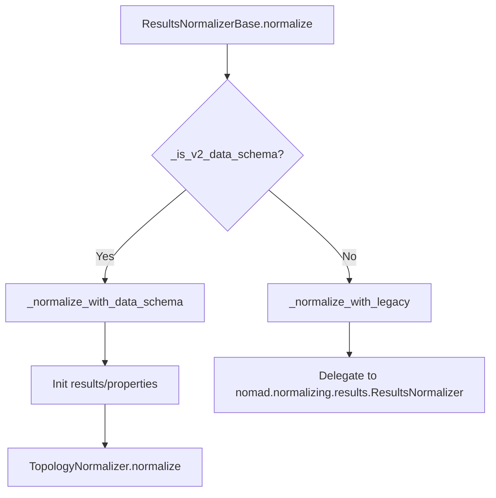

# Results + Topology Routing (Legacy vs v2, Simulation vs Generic v2)

This note documents the current logical split in `nomad-topology-normalizer`:

1. **Results-level split**: legacy vs v2 data path
2. **Topology-level split (inside v2 path)**: v2 simulation vs generic v2 `System`

It also answers the review question:
> "In Simulation logic here?" (comment near root/original cell population in `topology.py`)

---

## 1. Results-Level Split (Legacy vs v2)

**Entry point**
- `packages/nomad-topology-normalizer/src/nomad_topology_normalizer/normalizers/results.py`
- `ResultsNormalizerBase.normalize(...)`

### Where the split happens

- `ResultsNormalizerBase.normalize(...)`: `results.py:203`
- Calls `_is_v2_data_schema(...)`: `results.py:234`
- Routes to:
  - `_normalize_with_data_schema(...)` (plugin v2 path): `results.py:267`
  - `_normalize_with_legacy(...)` (delegate to NOMAD legacy ResultsNormalizer): `results.py:282`

### Visual



### What `_is_v2_data_schema()` currently means

`_is_v2_data_schema()` is **not** a generic "is any basesections.v2 object" check.
It is a check for **v2 structures that the plugin can handle as topology/system data**:

- `True` if `archive.data` is a direct `basesections.v2.System`
- `True` if `archive.data` has `model_system` (simulation-style v2 container), even if empty
- `False` for custom/non-structural `archive.data` without `model_system`

### Consequences for test files

- `first.archive.yaml` (`basesections.v2.BaseSection`) -> **legacy path**
- `second.archive.yaml` (`basesections.v2.System`) -> **v2 path**
- `test.archive.yaml` (custom schema package) -> **legacy path**

---

## 2. Topology-Level Split Inside the v2 Path

**Entry point (v2 only)**
- `packages/nomad-topology-normalizer/src/nomad_topology_normalizer/normalizers/topology.py`
- `TopologyNormalizer.normalize(...)`: `topology.py:376`

Once the **Results** normalizer decides "v2 path", the **Topology** normalizer still has its own internal waterfall:

### Where the split happens

- `TopologyNormalizer.topology(...)`: `topology.py:403`
- Waterfall:
  1. `topology_calculation()` -> parser-defined / simulation hierarchy: `topology.py:427`
  2. `topology_matid(...)` -> atomistic MatID detection: `topology.py` (later in file)
  3. `topology_data(...)` -> generic direct `SystemV2` fallback: `topology.py` (later in file)

### Visual

```mermaid
flowchart TD
    A[TopologyNormalizer.normalize] --> B[topology(material)]
    B --> C{Existing results.material.topology?}
    C -->|Yes| Z[Return None]
    C -->|No| D[topology_calculation]
    D -->|success| R[Use parser/simulation topology]
    D -->|None| E[topology_matid]
    E -->|success| S[Use MatID topology]
    E -->|None| F{archive.data is SystemV2?}
    F -->|Yes| G[topology_data]
    F -->|No| H[Return None]
```

---

## 3. Where "Simulation logic" starts in `topology.py`

Reviewer question was about this comment near `add_system_info_2(...)`:

- root/original node cell population comment in `topology.py` (around `add_system_info_2`)

### Short answer

Yes, **that specific helper is simulation-oriented v2 logic**.

### Why

`add_system_info_2(...)` is designed around:
- `particle_indices`
- `particle_states`
- `positions`
- `ModelSystem.to_ase_atoms()`

Those are simulation/atomistic concepts (or simulation-like `ModelSystem` concepts), even if reused for some direct `SystemV2` cases.

### Important nuance

`topology.py` as a whole is **not simulation-only**:

- `topology_calculation()` is **simulation-specific** (explicit parser hierarchy from `Simulation.model_system[0].sub_systems`)
- `topology_data()` is **generic v2 `System` fallback** (works for direct `archive.data: basesections.v2.System`)

So:
- The **comment in `add_system_info_2`** sits in code that is primarily simulation-ish
- But the **module-level topology normalizer** still supports generic non-simulation `SystemV2` entries through `topology_data()`

---

## 4. Practical mapping of the split (examples)

### A. Legacy / non-simulation custom schema (`test.archive.yaml`)
- `archive.data` = custom schema package section
- No `model_system`
- Not `SystemV2`
- **Results split** -> legacy delegate
- `TopologyNormalizer` plugin path is not used

### B. Generic v2 `BaseSection` (`first.archive.yaml`)
- `archive.data` = `basesections.v2.BaseSection`
- No `model_system`
- Not `SystemV2`
- **Results split** -> legacy delegate
- No topology/system results expected unless another normalizer provides them

### C. Generic v2 `System` (`second.archive.yaml`)
- `archive.data` = direct `basesections.v2.System`
- **Results split** -> v2 path
- **Topology split**:
  - `topology_calculation()` -> usually `None` (not a `Simulation`)
  - `topology_matid()` -> may be `None` (not enough atomistic data)
  - `topology_data()` -> populates `results.material.topology`

### D. v2 Simulation (`archive.data = Simulation`, with `model_system`)
- **Results split** -> v2 path
- **Topology split**:
  - `topology_calculation()` for parser-defined subsystem hierarchy (preferred)
  - fallback to `topology_matid()` if needed
  - fallback to `topology_data()` only for direct `SystemV2` entries, not `Simulation`

---

## 5. Key code references

### Results routing
- `results.py:203` `normalize(...)`
- `results.py:234` `_is_v2_data_schema(...)`
- `results.py:267` `_normalize_with_data_schema(...)`
- `results.py:282` `_normalize_with_legacy(...)`

### Topology routing (within v2 path)
- `topology.py:376` `TopologyNormalizer.normalize(...)`
- `topology.py:403` `topology(...)`
- `topology.py:427` `topology_calculation(...)`
- `topology.py` `topology_matid(...)`
- `topology.py` `topology_data(...)`

### Simulation-oriented helper under discussion
- `topology.py` `add_system_info_2(...)`

---

## 6. Takeaway

There are **two independent splits**:

1. **Results-level routing**
   - Decides if plugin v2 path is used at all
2. **Topology-level v2 routing**
   - Decides how topology is built (simulation hierarchy vs MatID vs generic `SystemV2`)

This is why a comment inside `add_system_info_2(...)` can be "simulation logic", while the overall `TopologyNormalizer` still supports generic non-simulation `SystemV2` entries.
